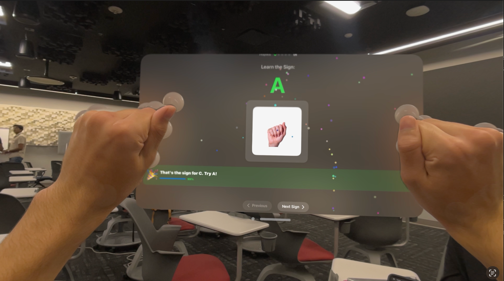
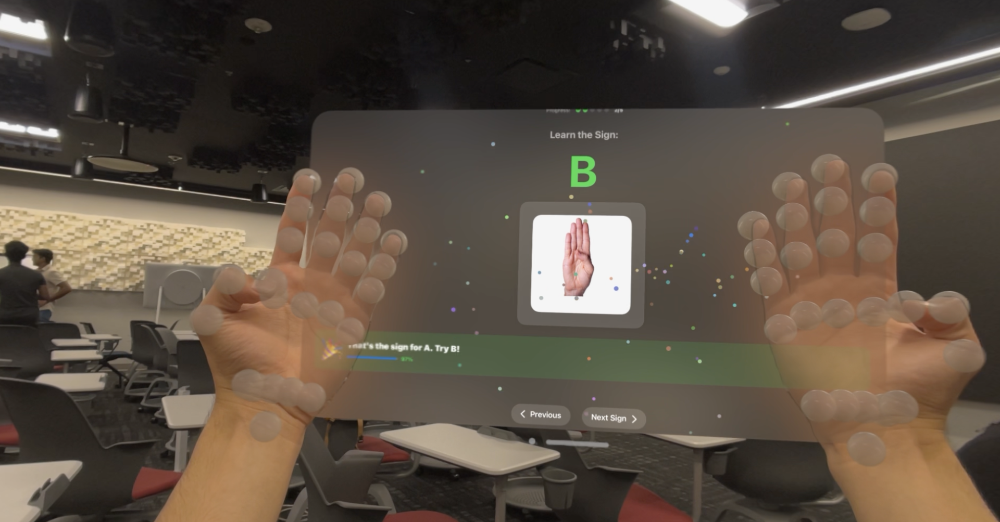
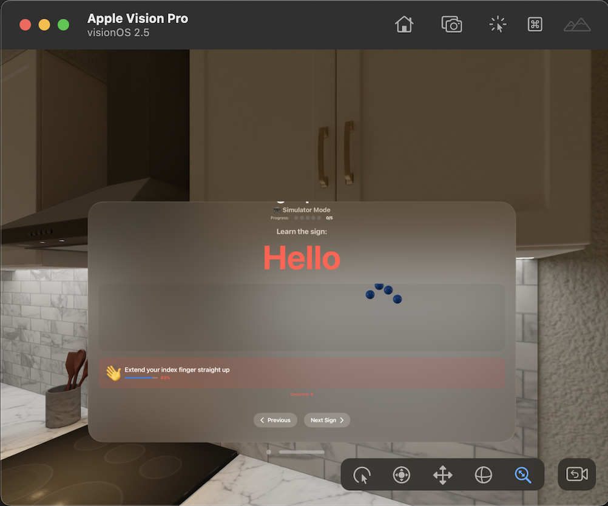
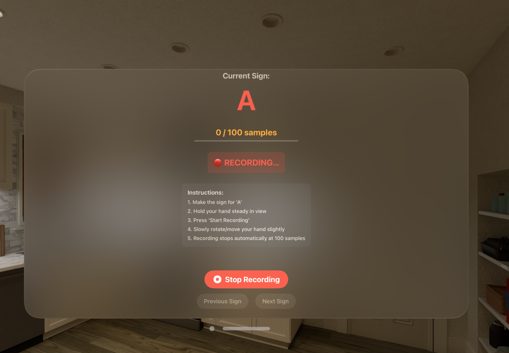

# SignSpace - Real-Time ASL Tutor with Apple Vision Pro

  

**Learn American Sign Language with instant, personalized feedback using spatial computing.**

Built at USC's **Good Vibes Only Buildathon 2025** | a16z x Vercel x PayPal x Lovable x Meta x Apple

## 🎯 The Problem

- **430 million people worldwide** need hearing support and rehabilitation  
- **500,000+ people** in the US use American Sign Language  
- Learning ASL is challenging without real-time, personalized feedback  
- Traditional methods (videos, books) lack interactive guidance  
- No way to verify if you're making signs correctly 

## 💡 Our Solution

**SignSpace** leverages Apple Vision Pro's advanced hand tracking to provide:

- **Real-time gesture recognition** – Detects ASL signs using ML-based classification  
- **Specific, actionable feedback** – “Move your thumb closer to your palm” instead of generic errors  
- **Progress tracking** – Visual indicators showing mastery of each sign  
- **Spatial visualization** – 3D hand skeleton with joint-level accuracy
- **Ghost hands overlay (Unused for now)** – Transparent “target” hands show the correct position (will be expanded upon in the next update) 

## 🎥 Demo

> 🎥 **[Demo Video](https://drive.google.com/file/d/1XPNRzenzS-k5-pO7UJ3PRrQrqJHE6at7/view?usp=sharing)**  
> 📺 **[Full Version (if Demo doesn’t load)](https://drive.google.com/file/d/1C_VZJxxrgt15Y8MPfRmrAKQ1d2wWfaRr/view?usp=sharing)**  

**Note:** In the full-length video, you’ll notice that the gesture recognition model was trained on specific hand placements (around 100 samples per sign). Because of that, the system only recognized gestures when they closely matched the positions seen during training. Additionally, the current ML recognizer occasionally references confidence values from other signs when generating feedback -- e.g., it might detect “A” and suggest “Try making C.” Future updates will align the ML feedback system with the same specificity and accuracy as the rule-based mock data version (shown below).


### 📸 Vision Pro In-Action

Below are screenshots from **SignSpace** running on Apple Vision Pro, showcasing live hand tracking, sign detection, and interactive feedback.

<p align="center">
  
  <br/>
  <em><strong>Sign A Detection:</strong> The system recognizes the sign “A” and provides a visual feedback bar indicating accuracy.</em>
</p>

<p align="center">
  
  <br/>
  <em><strong>Sign B Detection:</strong> The user performs the sign “B,” with real-time 3D gesture overlay and feedback display.</em>
</p>

<p align="center">
  
  <br/>
  <em><strong>Sign Detection Mode:</strong> The app detects the sign “Hello” using Apple Vision Pro’s 3D hand tracking and provides real-time, specific feedback (“Extend your index finger straight up”). Currently, this detailed feedback is available only in the mock data view, with live integration in progress.</em>
</p>

<p align="center">
  
  <br/>
  <em><strong>Data Recording Mode:</strong> Used to capture 100 samples per gesture for training the ML model, with clear on-screen instructions for proper hand positioning and motion.</em>
</p>

## 🛠️ Technology Stack

### Core Technologies
- **visionOS 2.5** – Native Apple Vision Pro development  
- **Swift 5.9** – Modern, type-safe programming  
- **SwiftUI** – Declarative UI framework  
- **RealityKit** – 3D rendering and spatial computing  
- **Hand Tracking API** – Real-time 27-joint precision tracking  
- **Core ML** – Integrated ASL gesture classifier  

### Key Features
- **Rule-Based + ML Gesture Recognition Engine** – Combines CoreML model with rule-based validation  
- **Spatial Hand Visualization** – 3D skeleton rendering with joint connections  
- **Adaptive Feedback System** – Confidence-based color coding (red/yellow/green)  
- **CSV Export + Share Sheet** – Export recorded samples for model retraining  
- **Mock Data Support** – Simulator testing without physical hardware  

## 🏗️ Architecture

The codebase follows an **MVVM (Model-View-ViewModel)** architecture for clean separation of concerns:

```
SignSpace/
├── App/                          # Application layer
│   ├── SignSpaceApp.swift        # App entry point + environment injection
│   └── AppModel.swift            # Immersive space state management
│
├── Views/                        # UI layer (SwiftUI)
│   ├── ContentView.swift         # Main learning interface
│   ├── DataCollectionView.swift  # Data collection & CSV export UI
│   ├── HandTrackingView.swift    # 3D hand entity rendering view
│   ├── ImmersiveView.swift       # RealityView for immersive mode
│   ├── ConfettiView.swift        # Confetti celebration animation
│   └── ToggleImmersiveSpaceButton.swift
│
├── ViewModels/                   # Business logic & state
│   ├── ContentViewModel.swift    # Learning flow logic + feedback state
│   └── DataCollectionViewModel.swift
│
├── Services/                     # Core functionality
│   ├── HandTrackingManager.swift      # ARKit session + 27-joint tracking
│   ├── HybridGestureRecognizer.swift  # Combines ML + rule-based recognition
│   ├── MLGestureRecognizer.swift      # CoreML-based gesture prediction
│   ├── GestureRecognizer.swift        # Rule-based geometric validation
│   ├── HandTrackingSystem.swift       # RealityKit ECS system
│   ├── HandTrackingComponent.swift    # RealityKit component
│   ├── CSVExporter.swift              # Training data export
│   └── SoundManager.swift             # Audio feedback
│
├── Models/                       # Data structures
│   ├── ASLSign.swift             # Sign enumeration (A, B, C, Hello, ThankYou)
│   ├── HandModels.swift          # HandData, HandJoint structs
│   ├── GestureResult.swift       # Recognition result container
│   ├── GhostHandData.swift       # Ideal hand positions per sign
│   ├── TrainingSample.swift      # ML training data structure
│   └── ASLClassifierReal1.mlmodel # CoreML gesture classifier
│
└── Assets/                       # ASL sign images + app assets
```

### Data Flow
```
Vision Pro Hand Tracking (27 joints @ 90Hz)
        ↓
HandTrackingManager (ARKit session → HandData)
        ↓
ContentViewModel (100ms polling timer)
        ↓
HybridGestureRecognizer
   ├── MLGestureRecognizer (primary, confidence > 0.88)
   └── GestureRecognizer (rule-based fallback)
        ↓
GestureResult (sign, confidence, feedback)
        ↓
ContentViewModel updates state
        ↓
ContentView renders UI + triggers audio/confetti
        ↓
User sees real-time corrections + progress tracking
```


## 🎨 Features

### 1. **Real-Time Hand Tracking**
- Powered by `ARKitSession` and `HandTrackingProvider`
- 27 tracked joints with live position updates
- Works seamlessly in immersive space

### 2. **Ghost Hands Overlay (unused for now)**
- Shows ideal ASL hand positions (from `GhostHandData`)
- Used for reference and spatial guidance  

### 3. **Dual Recognition System**
- **Rule-based:** geometry & distances between joints  
- **ML-powered:** CoreML model trained from real CSV data  

### 4. **Intelligent Feedback**
- **Green (≥85%)**: Perfect! 🎉  
- **Yellow (65–85%)**: Almost there!  
- **Red (<65%)**: Needs correction  
- **Gray**: No hand detected  

### 5. **Progress Tracking & Celebration**
- Tracks completed signs  
- Displays progress bar  
- Confetti on completion  

### 6. **Sound Feedback**
- Success tone (correct)  
- Progress tone (improving)  
- Error tone (incorrect)  

### 7. **Data Collection & Export**
- Record hand samples for each sign  
- Export labeled CSV for training CoreML models  
- Share sheet for direct file sharing  

## 📚 Supported ASL Signs

| Sign | Description | Difficulty |
|------|-------------|-------------|
| **A** | Closed fist, thumb on side | Easy |
| **B** | Fingers straight up, thumb tucked | Medium |
| **C** | Hand forms "C" curve | Easy |
| **Hello** | Open hand, all fingers extended | Easy |
| **Thank You** | Flat hand, fingers together (custom sign for testing) | Medium |

**Future:** Expand to full alphabet and 50+ phrases  

## 🚀 Getting Started

### Prerequisites
- macOS 14.0 or later  
- Xcode 15.0 or later  
- Apple Vision Pro (for real testing)  
- Apple Developer account  

### Installation
1. **Install repo**
```bash
git clone https://github.com/yourusername/SignSpace.git
cd SignSpace
open SignSpace.xcodeproj
```

2. **Add Hand Tracking Capability**
   - Select SignSpace project → Target → Signing & Capabilities
   - Click "+ Capability"
   - Add "Hand Tracking"

3. **Build and Run**
   - Select "Apple Vision Pro" simulator or physical device
   - Press `Cmd + R`

### Testing Without Vision Pro

The app includes **mock hand tracking** for simulator testing:
```swift
// In HandTrackingManager.swift (line 17)
var useMockData = true  // Simulator mode with animated hands
```

For real device testing:
```swift
var useMockData = false  // Real Vision Pro hand tracking
```

## 🎓 How It Works

### Hand Tracking Pipeline

1. **Initialize Session**
   - Requests `handTracking` authorization from ARKit.
   - Starts `ARKitSession` with `HandTrackingProvider`.
   - Continuously processes anchor updates at 90Hz for both hands.

2. **Extract Joint Data**
   - Captures 27 joints per hand: wrist, thumb, index, middle, ring, and pinky.
   - Converts joint transforms to world coordinates using `originFromAnchorTransform`.
   - Stores as `SIMD3<Float>` for spatial calculations.

3. **Gesture Recognition**
   - `HybridGestureRecognizer` intelligently combines two recognition methods:
     - **ML-powered (primary)**: CoreML model (`ASLClassifierReal1.mlmodel`) predicts gestures from 12 extracted features (6 joints × 2D coordinates). Used when confidence > 0.88.
     - **Rule-based (fallback)**: Uses distances and angles between joints for precision feedback when ML confidence is low.
   - This hybrid approach ensures accurate and interpretable recognition.

4. **Generate Feedback**
   - Calculates a confidence score (0–1).
   - Produces contextual feedback:
     - “Perfect!” if confidence > 0.9  
     - “Good try!” if 0.6–0.9  
     - “Show your hand” if tracking is lost
   - Feedback color dynamically updates (green/yellow/red/gray).

5. **Render Visualization**
   - `RealityView` displays real-time 3D hand skeletons.
   - `GhostHandData` overlays “ideal” hand position for the current sign.
   - Visual and audio cues provide instant correction guidance.

6. **Track Progress**
   - `ContentViewModel` maintains user progress via `signsLearned` state.
   - Confetti and success sound trigger on first mastery of each sign.
   - Progress indicators fill based on completed signs.

7. **Data Collection Mode**
   - Switch to `DataCollectionView` for ML training.
   - Captures hand features for each ASL sign and saves them as CSV.
   - Built-in `ShareSheet` enables exporting data directly.

## 🏆 Technical Highlights

### Why This Showcases Vision Pro
- **Native Hand Tracking:** Uses Vision Pro’s most advanced capability without external hardware, being privacy-preserving (processed locally).  
- **Spatial Feedback Loop:** Ghost hands are anchored in 3D space, enabling natural alignment.  
- **Real-Time Performance:** 90Hz input rate with <10ms latency feedback pipeline.  
- **On-Device ML:** All gesture processing is performed locally using CoreML for privacy and speed.  
- **Immersive Accessibility-First Learning:** Users learn through kinesthetic feedback rather than static visuals, making ASL learning accessible to all.  

## 🔮 Future Roadmap

### Phase 1 (MVP – Completed)
- [x] Vision Pro hand tracking integration  
- [x] CoreML gesture recognition (5 signs)  
- [x] Visual and audio feedback system  
- [x] Confetti + progress tracking  
- [x] CSV export for model retraining  

### Phase 2 (Next 3 Months)
- [ ] Full ASL alphabet coverage  
- [ ] Improved CoreML accuracy with larger dataset 
- [ ] Lesson-based user flow  
- [ ] Advanced analytics dashboard  

### Phase 3 (6 Months)
- [ ] SharePlay multiplayer mode  
- [ ] Video recording and playback  
- [ ] BSL/LSF language expansion  

### Phase 4 (12 Months)
- [ ] Enterprise integration (schools, hospitals)  
- [ ] Collaboration with accessibility researchers  
- [ ] iOS companion app for progress tracking

## 👥 Team

**Mustafa Nomair** – Computer Science @ USC  
*Led full product development — from design and coding to gesture detection, feedback logic, and Vision Pro app integration alongside Abdelaziz.*

**Abdelaziz Abderhman** – Electrical and Computer Engineering B.S. & Computer Engineering M.S. @ USC  
*Handled Vision Pro hardware setup and sensor integration for real-time hand tracking.*

**Hamza Wako** – Computer Science and Business Administration @ USC  
*Served as project manager, coordinating tasks, deadlines, and testing cycles.*

**Built at**: Good Vibes Only Buildathon 2025  
**Location**: USC Information Sciences Institute, Marina Del Rey 

## 🙏 Acknowledgments
- **USC Viterbi School of Engineering** - Venue and support
- **Apple** - Apple Vision Pro access 
- **PayPal** - Platinum sponsor
- **Lovable** - Technology partner and credits
- **Meta** - Judge participation
- **Microsoft** - Inclusive Tech Lab inspiration
Special thanks to all mentors and organizers who made this possible!

## 📞 Contact
**Mustafa Nomair**  
- Email: nomair@usc.edu
- LinkedIn: [View Profile](https://www.linkedin.com/in/mustafa-nomair)
- Project Demo: [Video Link](https://drive.google.com/file/d/1XPNRzenzS-k5-pO7UJ3PRrQrqJHE6at7/view?usp=sharing)

## ⭐ Support
If you enjoyed this project or found it useful, consider giving it a ⭐ on GitHub - it helps others discover SignSpace!

*Making the world more inclusive, one sign at a time.* 🤟
